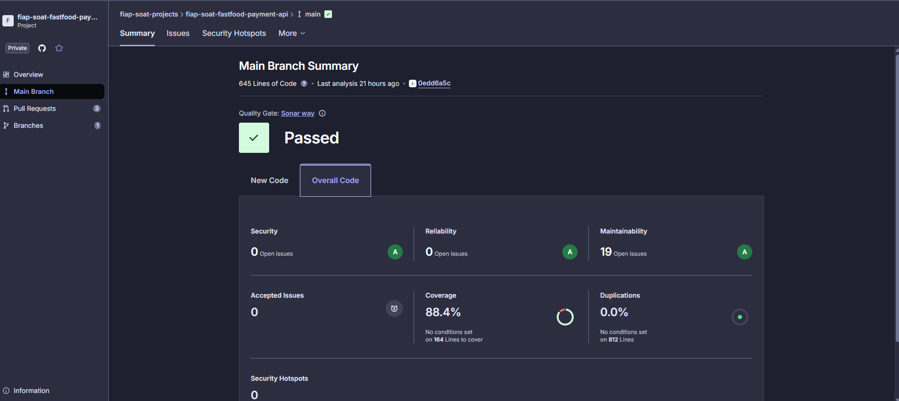
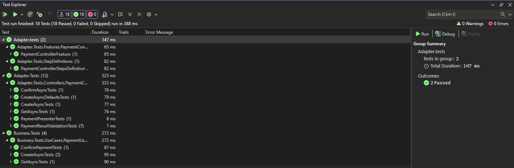

# 🍔 Payment API

Este projeto foi desenvolvido para o curso de [pós-graduação em Arquitetura de Software (Soat Póstech) da FIAP](https://postech.fiap.com.br/curso/software-architecture/).

A API presente neste repositório disponibiliza rotas para gerenciamento de pagamentos, com integração direta com [MongoDB](https://www.mongodb.com/) e [Mercado Pago](https://www.mercadopago.com.br/developers/pt/reference).

## 🏃 Integrantes do grupo

- Jeferson dos Santos Gomes - **RM 362669**
- Jamison dos Santos Gomes - **RM 362671**
- Alison da Silva Cruz - **RM 362628**

## 📜 Linguagem Ubíqua 

Para mais detalhes sobre a linguagem do domínio, consulte [`docs/ubiquitous-language.md`](docs/ubiquitous-language.md).

## 👨‍💻 Tecnologias Utilizadas

- **.NET 8** (C# 12)
- **ASP.NET Core Web API**
- **MongoDB** (banco de dados)
- **Mongo Express** (cliente web para MongoDB)
- **Docker** e **Docker Compose**
- **Kubernetes** (gerenciamento de containers)
- **Polly** (resiliência HTTP)
- **Swagger** (documentação automática)
- **MercadoPago** (integração de pagamentos via Pix)

## 🏁 Como Inicializar

### Pré-requisitos

- 🐈‍⬛ Clonar este [Repositório](https://github.com/fiap-soat-projects/fiap-soat-fastfood-payment-api)
- 🐳 Instalar o [Docker](https://www.docker.com/get-started/)
- ☸️ Habilitar o Kubernetes no [Docker](https://docs.docker.com/desktop/features/kubernetes/)

Passos para executar a aplicação:

### **Docker**:

No diretório raiz do projeto, utilize uma ferramenta de linha de comando de sua preferência e execute o comando `docker-compose up --build`.

A API e seus recursos estão disponíveis em:
- **API**: [http://localhost:8080/swagger](http://localhost:8080/swagger)
- **Mongo Express**: [http://localhost:8081](http://localhost:8081)

## Endpoints Disponíveis

### 💸 Transaction (Pagamento)
- `POST /payment/create` — Cria as informações de pagamento utilizando a integração com o Mercado Pago
- `POST /payment/{id}/confirm-payment` — Confirmar pagamento
- `GET /payment/{id}` — Retorna as informações do pagamento com base no ID

## 👤 Convenções

- Todos os endpoints aceitam e retornam JSON.
- Utilize o Swagger para explorar e testar os endpoints.

## Análise de código e testes

## 🏦 Banco de Dados

Neste projeto utilizamos o [MongoDB Atlas](https://www.mongodb.com/products/platform) que é um serviço de banco de dados como serviço (DBaaS) totalmente gerenciado para o MongoDB, disponível na nuvem. Ele permite criar, escalar e gerenciar clusters MongoDB de forma simples, segura e automatizada, sem a necessidade de gerenciar infraestrutura física. O Atlas oferece recursos como backups automáticos, monitoramento, alta disponibilidade, escalabilidade sob demanda e integração com provedores de nuvem como AWS, Azure e Google Cloud.

#### 📦 Estrutura das Collections MongoDB

##### **payment**

| Campo           | Tipo   |
|-----------------|--------|
| Id              | string |
| orderId         | string |
| customerId      | string |
| customerName    | string |
| customerEmail   | string |
| totalPrice      | decimal|
| paymentMethod   | string |
| paymentStatus   | string |
| paymentResponse | string |

---

## 🧩 Arquitetura: Princípios SOLID & Clean Architecture

Este projeto foi estruturado seguindo os princípios do **SOLID** e os conceitos do **Clean Architecture**, visando garantir um sistema desacoplado, coeso, testável e de fácil manutenção.

### Princípios SOLID

- **S**ingle Responsibility Principle (Responsabilidade Única):  
  Cada classe ou módulo possui uma única responsabilidade bem definida, facilitando a manutenção e evolução do código.

- **O**pen/Closed Principle (Aberto/Fechado):  
  Os componentes do sistema são abertos para extensão, mas fechados para modificação, permitindo adicionar novas funcionalidades sem alterar o código existente.

- **L**iskov Substitution Principle (Substituição de Liskov):  
  As subclasses podem ser substituídas por suas classes base sem afetar o funcionamento do sistema.

- **I**nterface Segregation Principle (Segregação de Interfaces):  
  Interfaces específicas são preferidas a interfaces genéricas, evitando que classes dependam de métodos que não utilizam.

- **D**ependency Inversion Principle (Inversão de Dependência):  
  O domínio depende de abstrações (interfaces), e não de implementações concretas, promovendo baixo acoplamento entre as camadas.

### Clean Architecture

- **Separação de Camadas:**  
  O projeto é dividido em camadas bem definidas, separada por projetos de Business, Adapters, Drivers(Api, Infrastructure)

- **Isolamento da Lógica de Negócio:**  
  A lógica de negócio reside na camada de domínio (Business), isolada de detalhes técnicos e de infraestrutura.

- **Gateways e Interfaces:**  
  Dependências externas (bancos de dados, APIs, etc.) são representadas por interfaces na camada de domínio. As implementações concretas ficam na infraestrutura.

- **Injeção de Dependências:**  
  A ligação entre interfaces e implementações é feita via injeção de dependências, facilitando testes e substituição de componentes.

**Benefícios:**
- Facilita testes unitários e integração.
- Permite evolução e manutenção do sistema sem impactar a lógica de negócio.
- Garante flexibilidade para trocar tecnologias e integrações externas.
- Segue as melhores práticas de arquitetura de software moderna.

> **Resumo:**  
> O projeto foi desenhado para que cada camada tenha responsabilidades claras e isoladas, promovendo um código limpo, sustentável e preparado para mudanças futuras.
